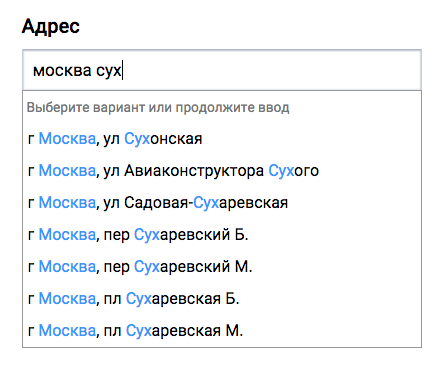

API Подсказок DaData.ru для C# / .NET
====================

Описание
---------------

Библиотека `suggestions-csharp` — это обертка над [API подсказок](https://dadata.ru/api/suggest/) DaData.ru для C# и других .NET-языков.



Установка
---------

### 1. Подключите библиотеку

Прежде всего, скачайте [бинарники](https://github.com/hflabs/suggestions-csharp/releases/tag/16.10) и подключите их к своему проекту.

Внешние зависимости:

- [RestSharp](http://restsharp.org/)
- [NUnit](http://www.nunit.org/) (для тестов)


### 2. Получите API-ключи

Зарегистрируйтесь на [dadata.ru](https://dadata.ru) и получите API-ключи в [личном кабинете](https://dadata.ru/profile/#info).

### 3. Пользуйтесь API!

Примеры вызова API смотрите в юнит-тестах (`SuggestClientTest`) или ниже по тексту.

Использование
---------

Работают подсказки по:

- почтовому адресу,
- реквизитам организации или банка,
- ФИО,
- адресу эл. почты.

```csharp
var token = "ВАШ API-КЛЮЧ";
var url = "https://suggestions.dadata.ru/suggestions/api/4_1/rs";
var api = new SuggestClient(token, url);
var query = "москва серпухов";
var response = api.QueryAddress(query);
Console.WriteLine(string.Join("\n", response.suggestions));
```
